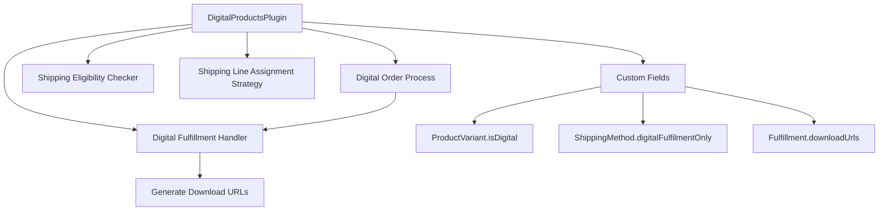

# Digital Products Plugin - Design Document

## Overview

The Digital Products Plugin extends Vendure to support electronic product delivery. It introduces custom fields to distinguish digital from physical products, implements automatic fulfillment upon payment authorization, and manages download URL generation. The plugin integrates seamlessly with Vendure's existing order processing workflow through custom handlers and strategies.

## Architecture

The plugin follows Vendure's plugin architecture pattern using the `@VendurePlugin` decorator. It consists of:

1. **Custom Fields**: Extensions to existing Vendure entities (ProductVariant, ShippingMethod, Fulfillment)
2. **Fulfillment Handler**: Logic for creating digital product fulfillments and generating download URLs
3. **Shipping Eligibility Checker**: Determines when digital shipping methods are applicable
4. **Shipping Line Assignment Strategy**: Routes digital products to digital shipping methods
5. **Order Process**: Automates fulfillment when payment is authorized

### Component Diagram



## Components and Interfaces

### 1. Plugin Structure

**File**: `src/plugins/digital-products/digital-products.plugin.ts`

The main plugin class that:
- Imports `PluginCommonModule` for access to Vendure services
- Configures custom fields on ProductVariant, ShippingMethod, and Fulfillment entities
- Registers the digital fulfillment handler
- Registers the shipping eligibility checker
- Configures the shipping line assignment strategy
- Registers the order process for automatic fulfillment

### 2. Custom Fields Configuration

#### ProductVariant Custom Field
- **Name**: `isDigital`
- **Type**: boolean
- **Default**: false
- **Purpose**: Marks a product variant as digital
- **Public**: true (accessible via Shop API)

#### ShippingMethod Custom Field
- **Name**: `digitalFulfilmentOnly`
- **Type**: boolean
- **Default**: false
- **Purpose**: Indicates shipping method is for digital products only
- **Public**: true

#### Fulfillment Custom Field
- **Name**: `downloadUrls`
- **Type**: string[] (list)
- **Nullable**: true
- **Purpose**: Stores download URLs for digital products
- **Public**: true

### 3. Digital Fulfillment Handler

**File**: `src/plugins/digital-products/config/digital-fulfillment-handler.ts`

**Responsibilities**:
- Identifies digital products in order lines
- Generates unique download URLs for each digital product
- Creates fulfillment records with download URLs

**Key Methods**:
- `init(injector)`: Initializes TransactionalConnection for database access
- `createFulfillment(ctx, orders, lines)`: Main fulfillment logic
  - Fetches OrderLine entities with ProductVariant relations
  - Filters for digital products using `isDigital` custom field
  - Generates download URLs via `generateDownloadUrl()`
  - Returns fulfillment data with method, tracking code, and download URLs

**Download URL Generation**:
- Current implementation: Generates placeholder URLs with random keys
- Production implementation: Should integrate with external digital asset management system
- Format: `https://example.com/download?key={unique-key}`

### 4. Shipping Eligibility Checker

**File**: `src/plugins/digital-products/config/digital-shipping-eligibility-checker.ts`

**Purpose**: Ensures digital shipping methods only appear when order contains digital products

**Logic**:
- Filters order lines to find those with `isDigital = true`
- Returns `true` if at least one digital product exists
- Returns `false` otherwise

**Integration**: Used when calculating `eligibleShippingMethods` in Shop API

### 5. Shipping Line Assignment Strategy

**File**: `src/plugins/digital-products/config/digital-shipping-line-assignment-strategy.ts`

**Purpose**: Assigns order lines to appropriate shipping methods based on product type

**Logic**:
- If shipping method has `digitalFulfilmentOnly = true`:
  - Assign only order lines with `isDigital = true`
- If shipping method has `digitalFulfilmentOnly = false`:
  - Assign only order lines with `isDigital = false`

**Result**: Orders with mixed product types will have multiple shipping lines

### 6. Digital Order Process

**File**: `src/plugins/digital-products/config/digital-order-process.ts`

**Purpose**: Automatically fulfill digital products when payment is authorized

**State Transitions Monitored**:
- `ArrangingPayment` → `PaymentAuthorized`
- `ArrangingPayment` → `PaymentSettled`

**Logic**:
- Filters order lines for digital products
- If digital products exist, creates fulfillment using `OrderService.createFulfillment()`
- Uses digital fulfillment handler code
- Includes all digital order lines with their quantities

**Dependencies**:
- `OrderService`: Injected via `init()` method
- `digitalFulfillmentHandler`: Referenced by code

## Data Models

### Custom Field Extensions

```typescript
// ProductVariant extension
interface ProductVariantCustomFields {
  isDigital: boolean;
}

// ShippingMethod extension
interface ShippingMethodCustomFields {
  digitalFulfilmentOnly: boolean;
}

// Fulfillment extension
interface FulfillmentCustomFields {
  downloadUrls: string[] | null;
}
```

### Fulfillment Data Structure

```typescript
interface DigitalFulfillmentData {
  method: 'Digital Fulfillment';
  trackingCode: 'DIGITAL';
  customFields: {
    downloadUrls: string[];
  };
}
```

## Error Handling

### Database Access Errors
- **Context**: When fetching OrderLine entities in fulfillment handler
- **Strategy**: Let Vendure's error handling propagate database errors
- **User Impact**: Fulfillment creation will fail, order remains in current state

### Missing Product Variant Relations
- **Context**: When OrderLine doesn't have productVariant loaded
- **Strategy**: Explicitly load relations in repository query
- **Prevention**: Use `relations: { productVariant: true }` in find options

### Download URL Generation Failures
- **Context**: When external system fails to generate URL
- **Strategy**: Implement try-catch in `generateDownloadUrl()`
- **Fallback**: Log error and skip that product (or fail entire fulfillment)
- **Future Enhancement**: Implement retry logic or queue for later processing

### Invalid State Transitions
- **Context**: Order process triggered in unexpected state
- **Strategy**: Guard clauses check exact state transitions
- **Prevention**: Only act on specific `fromState` and `toState` combinations

## Testing Strategy

### Unit Tests

1. **Custom Field Configuration**
   - Verify custom fields are added to correct entities
   - Verify default values and public accessibility
   - Verify field types and constraints

2. **Fulfillment Handler**
   - Test digital product identification
   - Test download URL generation
   - Test fulfillment data structure
   - Mock TransactionalConnection and OrderLine repository

3. **Shipping Eligibility Checker**
   - Test with order containing only digital products (should return true)
   - Test with order containing only physical products (should return false)
   - Test with order containing mixed products (should return true)
   - Test with empty order (should return false)

4. **Shipping Line Assignment Strategy**
   - Test digital shipping method assigns only digital products
   - Test physical shipping method assigns only physical products
   - Test with mixed order creates correct assignments

5. **Order Process**
   - Test fulfillment creation on PaymentAuthorized transition
   - Test fulfillment creation on PaymentSettled transition
   - Test no action on other state transitions
   - Test with order containing no digital products (no fulfillment created)
   - Mock OrderService.createFulfillment

### Integration Tests

1. **End-to-End Order Flow**
   - Create order with digital product
   - Add to cart and checkout
   - Authorize payment
   - Verify automatic fulfillment creation
   - Verify download URLs in fulfillment

2. **Mixed Order Handling**
   - Create order with both digital and physical products
   - Verify multiple shipping methods can be selected
   - Verify correct shipping line assignments
   - Verify only digital products auto-fulfilled on payment

3. **Shipping Method Eligibility**
   - Query eligibleShippingMethods with digital products
   - Verify digital shipping method appears
   - Query with only physical products
   - Verify digital shipping method does not appear

## Configuration and Setup

### Plugin Registration

Add to `src/vendure-config.ts`:

```typescript
import { DigitalProductsPlugin } from './plugins/digital-products/digital-products.plugin';

export const config: VendureConfig = {
  // ... other config
  plugins: [
    // ... other plugins
    DigitalProductsPlugin,
  ],
};
```

### Database Migration

After adding custom fields, generate and run migration:

```bash
npm run migration:generate digital-products
npm run migration:run
```

### Admin Configuration

1. **Create Digital Shipping Method**:
   - Name: "Digital Download"
   - Price: 0
   - Check "digitalFulfilmentOnly" custom field
   - Select "digital-fulfillment" handler
   - Select "digital-shipping-eligibility-checker"

2. **Mark Digital Products**:
   - Edit product variants
   - Check "This product is digital" custom field

## Implementation Notes

### TypeScript Configuration

The plugin uses TypeScript with Vendure's type system. Custom field types are automatically extended through Vendure's type generation.

### Dependency Injection

All services (TransactionalConnection, OrderService) are injected via Vendure's dependency injection system using the `init()` method pattern.

### Transaction Safety

Database operations in fulfillment handler and order process run within Vendure's transaction context via `TransactionalConnection`.

### Production Considerations

1. **Download URL Generation**: Replace placeholder implementation with integration to:
   - Digital asset management system
   - Secure token generation service
   - Time-limited access URLs
   - Download tracking and analytics

2. **Security**:
   - Implement URL expiration
   - Add download attempt limits
   - Validate user authorization before serving files
   - Use signed URLs for S3/CDN integration

3. **Scalability**:
   - Consider async URL generation for large orders
   - Implement caching for frequently accessed digital assets
   - Use job queue for fulfillment processing if needed

4. **Monitoring**:
   - Log fulfillment creation events
   - Track download URL generation failures
   - Monitor automatic fulfillment success rate
   - Alert on repeated failures

## Future Enhancements

1. **License Key Management**: Generate and track software license keys
2. **Download Limits**: Enforce maximum download attempts per purchase
3. **Expiration Dates**: Set time limits on download access
4. **Email Notifications**: Send download links via email automatically
5. **Customer Portal**: Provide interface for customers to access all digital purchases
6. **Versioning**: Support product updates and version downloads
7. **DRM Integration**: Add digital rights management for protected content
