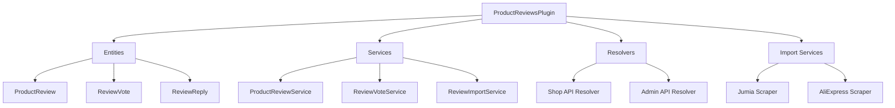

# Product Reviews Plugin - Design Document

## Overview

The Product Reviews Plugin provides a complete review and rating system for Vendure products. It includes customer-facing features for submitting and viewing reviews with images, admin moderation capabilities, helpful vote tracking, verified purchase badges, and automated import functionality from Jumia and AliExpress platforms.

## Architecture

The plugin follows Vendure's standard plugin architecture with:

1. **Entities**: ProductReview, ReviewImage (using Asset), ReviewVote, ReviewReply
2. **Services**: ProductReviewService, ReviewImportService, ReviewVoteService
3. **Resolvers**: Shop API and Admin API resolvers for reviews
4. **Import Scrapers**: Jumia and AliExpress review scrapers
5. **Custom Fields**: Product aggregate review statistics

### Component Diagram



## Components and Interfaces

### 1. ProductReview Entity

**File**: `src/plugins/product-reviews/entities/product-review.entity.ts`

**Fields**:
- `id`: Primary key
- `createdAt`, `updatedAt`: Timestamps
- `product`: ManyToOne relation to Product
- `productId`: ID of the product
- `customer`: ManyToOne relation to Customer (nullable for imported reviews)
- `customerId`: ID of the customer (nullable)
- `rating`: Integer 1-5
- `title`: String (max 255 chars)
- `content`: Text
- `authorName`: String (for imported reviews or anonymous)
- `authorLocation`: String (optional)
- `status`: Enum (pending, approved, rejected)
- `verifiedPurchase`: Boolean
- `upvotes`: Integer (default 0)
- `downvotes`: Integer (default 0)
- `images`: ManyToMany relation to Asset
- `replies`: OneToMany relation to ReviewReply
- `source`: String (vendure, jumia, aliexpress)

### 2. ReviewVote Entity

**File**: `src/plugins/product-reviews/entities/review-vote.entity.ts`

**Purpose**: Track customer votes on review helpfulness

**Fields**:
- `id`: Primary key
- `createdAt`, `updatedAt`: Timestamps
- `review`: ManyToOne relation to ProductReview
- `reviewId`: ID of the review
- `customer`: ManyToOne relation to Customer
- `customerId`: ID of the customer
- `vote`: Enum (up, down)

**Unique Constraint**: (reviewId, customerId) - prevents duplicate votes

### 3. ReviewReply Entity

**File**: `src/plugins/product-reviews/entities/review-reply.entity.ts`

**Purpose**: Allow responses to reviews

**Fields**:
- `id`: Primary key
- `createdAt`, `updatedAt`: Timestamps
- `review`: ManyToOne relation to ProductReview
- `reviewId`: ID of the review
- `customer`: ManyToOne relation to Customer (nullable)
- `customerId`: ID of the customer (nullable)
- `administrator`: ManyToOne relation to Administrator (nullable)
- `administratorId`: ID of the administrator (nullable)
- `content`: Text
- `isAdminReply`: Boolean

### 4. Product Custom Fields

**Purpose**: Store aggregate review statistics on Product entity

**Fields**:
- `averageRating`: Float (0-5)
- `reviewCount`: Integer
- `ratingDistribution`: JSON object with counts for each star rating

### 5. ProductReviewService

**File**: `src/plugins/product-reviews/services/product-review.service.ts`

**Methods**:

- `createReview(ctx, input)`: Create a new review
  - Validates rating (1-5)
  - Sets status to pending
  - Checks if customer purchased product (verifiedPurchase)
  - Uploads and associates images
  - Returns created review

- `getReviewsForProduct(ctx, productId, options)`: Get paginated reviews
  - Filters by status (approved only for Shop API)
  - Supports sorting (date, rating, helpfulness)
  - Supports filtering by rating
  - Includes images and vote counts
  - Returns paginated list

- `approveReview(ctx, reviewId)`: Approve a review
  - Updates status to approved
  - Recalculates product statistics
  - Returns updated review

- `rejectReview(ctx, reviewId)`: Reject a review
  - Updates status to rejected
  - Recalculates product statistics
  - Returns updated review

- `updateProductStatistics(ctx, productId)`: Recalculate stats
  - Calculates average rating
  - Counts reviews by rating
  - Updates Product custom fields
  - Called after review status changes

- `checkVerifiedPurchase(ctx, customerId, productId)`: Check if customer purchased
  - Queries Order entities
  - Checks for completed orders containing product
  - Returns boolean

### 6. ReviewVoteService

**File**: `src/plugins/product-reviews/services/review-vote.service.ts`

**Methods**:

- `voteOnReview(ctx, reviewId, vote)`: Add or update vote
  - Checks for existing vote
  - Creates or updates ReviewVote entity
  - Updates upvotes/downvotes count on ProductReview
  - Returns updated review

- `getVoteForReview(ctx, reviewId)`: Get customer's vote
  - Returns existing vote or null
  - Used to show current vote state in UI

### 7. ReviewImportService

**File**: `src/plugins/product-reviews/services/review-import.service.ts`

**Methods**:

- `importFromJumia(ctx, productId, jumiaUrl)`: Import Jumia reviews
  - Parses Jumia URL or product ID
  - Scrapes review data using HTTP client
  - Extracts rating, text, author, date, images
  - Downloads and uploads images as Assets
  - Creates ProductReview entities with source='jumia'
  - Returns import summary (success count, errors)

- `importFromAliExpress(ctx, productId, aliexpressUrl)`: Import AliExpress reviews
  - Parses AliExpress URL or product ID
  - Scrapes review data using HTTP client
  - Extracts rating, text, author, date, images
  - Downloads and uploads images as Assets
  - Creates ProductReview entities with source='aliexpress'
  - Returns import summary (success count, errors)

- `scrapeJumiaReviews(url)`: Scrape Jumia page
  - Uses axios or puppeteer for scraping
  - Parses HTML to extract review data
  - Returns array of review objects

- `scrapeAliExpressReviews(url)`: Scrape AliExpress page
  - Uses axios or puppeteer for scraping
  - Handles AliExpress API if available
  - Parses HTML/JSON to extract review data
  - Returns array of review objects

- `downloadAndUploadImage(ctx, imageUrl)`: Download external image
  - Downloads image from URL
  - Uploads to Vendure as Asset
  - Returns Asset entity

## Data Models

### ProductReview Type

```typescript
interface ProductReview {
  id: ID;
  createdAt: DateTime;
  updatedAt: DateTime;
  product: Product;
  customer?: Customer;
  rating: number; // 1-5
  title: string;
  content: string;
  authorName: string;
  authorLocation?: string;
  status: ReviewStatus; // pending | approved | rejected
  verifiedPurchase: boolean;
  upvotes: number;
  downvotes: number;
  images: Asset[];
  replies: ReviewReply[];
  source: string; // vendure | jumia | aliexpress
}
```

### Review Statistics

```typescript
interface ReviewStatistics {
  averageRating: number;
  totalReviews: number;
  ratingDistribution: {
    1: number;
    2: number;
    3: number;
    4: number;
    5: number;
  };
}
```

### Import Result

```typescript
interface ImportResult {
  success: boolean;
  importedCount: number;
  errors: string[];
  reviews: ProductReview[];
}
```

## GraphQL API Design

### Shop API

**Queries**:

```graphql
type Query {
  productReviews(
    productId: ID!
    options: ProductReviewListOptions
  ): ProductReviewList!
  
  productReviewStatistics(productId: ID!): ReviewStatistics!
}

type ProductReviewList {
  items: [ProductReview!]!
  totalItems: Int!
}

input ProductReviewListOptions {
  skip: Int
  take: Int
  sort: ProductReviewSortParameter
  filter: ProductReviewFilterParameter
}

input ProductReviewSortParameter {
  createdAt: SortOrder
  rating: SortOrder
  helpfulness: SortOrder
}

input ProductReviewFilterParameter {
  rating: NumberOperators
  verifiedPurchase: BooleanOperators
}
```

**Mutations**:

```graphql
type Mutation {
  submitProductReview(input: SubmitProductReviewInput!): ProductReview!
  
  voteOnReview(reviewId: ID!, vote: VoteType!): ProductReview!
  
  addReviewReply(reviewId: ID!, content: String!): ReviewReply!
}

input SubmitProductReviewInput {
  productId: ID!
  rating: Int!
  title: String!
  content: String!
  imageIds: [ID!]
}

enum VoteType {
  UP
  DOWN
}
```

### Admin API

**Queries**:

```graphql
type Query {
  productReviews(
    options: ProductReviewListOptions
  ): ProductReviewList!
  
  productReview(id: ID!): ProductReview
}
```

**Mutations**:

```graphql
type Mutation {
  approveProductReview(id: ID!): ProductReview!
  
  rejectProductReview(id: ID!): ProductReview!
  
  deleteProductReview(id: ID!): DeletionResponse!
  
  importReviewsFromJumia(
    productId: ID!
    jumiaUrl: String!
  ): ReviewImportResult!
  
  importReviewsFromAliExpress(
    productId: ID!
    aliexpressUrl: String!
  ): ReviewImportResult!
}

type ReviewImportResult {
  success: Boolean!
  importedCount: Int!
  errors: [String!]!
}
```

## Error Handling

### Validation Errors
- **Invalid Rating**: Throw UserInputError if rating not 1-5
- **Missing Required Fields**: Throw UserInputError for title/content
- **Duplicate Review**: Check if customer already reviewed product

### Import Errors
- **Invalid URL**: Validate URL format before scraping
- **Scraping Failure**: Catch HTTP errors, return in errors array
- **Image Download Failure**: Log error, continue with text-only review
- **Rate Limiting**: Implement delays between requests
- **Product Not Found**: Throw UserInputError if productId invalid

### Permission Errors
- **Unauthorized Review Submission**: Require authenticated customer
- **Unauthorized Moderation**: Require admin permission
- **Unauthorized Import**: Require admin permission

## Testing Strategy

### Unit Tests

1. **ProductReviewService**
   - Test review creation with valid data
   - Test rating validation (reject < 1 or > 5)
   - Test verified purchase check
   - Test statistics calculation
   - Mock TransactionalConnection

2. **ReviewVoteService**
   - Test vote creation
   - Test vote update (change from up to down)
   - Test duplicate vote prevention
   - Test vote count updates

3. **ReviewImportService**
   - Test URL parsing
   - Test review data extraction
   - Test image download and upload
   - Mock HTTP requests

### Integration Tests

1. **Review Submission Flow**
   - Create customer and product
   - Submit review via Shop API
   - Verify review created with pending status
   - Verify images associated

2. **Review Moderation Flow**
   - Create pending review
   - Approve via Admin API
   - Verify status changed
   - Verify statistics updated

3. **Import Flow**
   - Mock Jumia/AliExpress responses
   - Import reviews via Admin API
   - Verify reviews created
   - Verify images uploaded

## Implementation Notes

### Image Handling

- Use Vendure's AssetService for uploads
- Support multiple images per review (max 5)
- Validate image types (JPEG, PNG, WebP)
- Generate thumbnails automatically via Vendure

### Scraping Strategy

- Use axios for simple HTML scraping
- Use puppeteer for JavaScript-heavy sites
- Implement rate limiting (1 request per second)
- Cache scraped data to avoid re-scraping
- Handle pagination for sites with many reviews

### Performance Considerations

- Index review status and productId for fast queries
- Cache product statistics (update on review approval)
- Paginate review lists (default 10 per page)
- Lazy load images in UI

### Security Considerations

- Sanitize review content (prevent XSS)
- Validate image uploads (file type, size)
- Rate limit review submissions (1 per customer per product)
- Require authentication for voting
- Admin-only access for imports and moderation

## Configuration Options

```typescript
interface ProductReviewsPluginOptions {
  // Maximum images per review
  maxImagesPerReview?: number; // default: 5
  
  // Auto-approve reviews from verified purchases
  autoApproveVerified?: boolean; // default: false
  
  // Enable review replies
  enableReplies?: boolean; // default: true
  
  // Enable review imports
  enableImports?: boolean; // default: true
  
  // Scraping user agent
  scrapingUserAgent?: string;
}
```

## Future Enhancements

1. **Email Notifications**: Notify customers when reviews are approved
2. **Review Reminders**: Email customers after purchase to request review
3. **Review Rewards**: Award loyalty points for reviews
4. **AI Moderation**: Auto-detect spam or inappropriate content
5. **Review Analytics**: Dashboard with review trends
6. **Multi-language Reviews**: Support reviews in different languages
7. **Video Reviews**: Allow video uploads
8. **Review Questions**: Allow customers to ask questions on reviews
